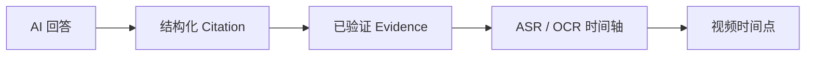

# VideoMind

> 面向长视频理解的 AI 视频分析工作台

VideoMind 将视频语音与画面文字转换为带时间、来源身份和版本的 VideoContext，通过 Hybrid RAG 为 Planner → Executor → Critic 提供证据。应用层校验模型引用的原文、来源 ID、revision 与时间范围，工作台把结构化结论关联到已校验的答案级 Citation，并允许点击返回原片。

当前 `main` 包含 M1 多轮记忆、默认关闭的 M2 受限多查询检索和 F1 结论证据展示。**F1 状态：CODE FREEZE READY — LIVE GATE PENDING**。代码回归与真实 Redis 验证完成；当前工作区缺少模型配置与测试媒体，最新 Agent/M1 真实视频链路尚未验收。历史已发布的 v0.1.0 与当前 main 分别记录，见 [最终验收报告](docs/FINAL_FREEZE_REPORT.md)。


**视频 ↔ 时间轴 ↔ 证据 ↔ AI** · 中文工作台 · Pixel Future Academy

## 为什么是 VideoMind

长视频中的事实分散在语音与画面文字中。一次性把全部转录文本交给模型既昂贵，也很难把答案与原片对应。VideoMind 保存带时间的 ASR/OCR 来源记录，先检索再分析，并把经过校验的答案级引用连接到 Evidence、时间轴和播放器。



## 核心能力

AI 交互入口使用 **Redis + Lua 用户级与全局级双维分布式 Token Bucket**。
每个请求消费 1 token；Redis TIME 驱动连续补充，Lua 原子完成双桶
refill、检查和同时扣减。分析在权限校验、完成结果复用之后、RabbitMQ
入队之前准入；Redis 异常返回 503 并 fail-closed，额度不足返回 429 与
Retry-After。默认用户容量 60、全局容量 600，60 秒完整补充。它控制请求
提交速率；LLM token 预算仍由独立执行预算管理。见 [限流设计与验证](docs/AI_INTERACTION_RATE_LIMIT.md)。

| 能力             | 在工作台中的作用                                                                             |
| ---------------- | -------------------------------------------------------------------------------------------- |
| 长视频分析       | 60 秒上下文窗口、分块、分页时序记录和检索式上下文，让分析聚焦相关片段。                      |
| 多模态时间轴     | 在视频播放位置附近查看 ASR、OCR 和引用标记；逐条记录保留来源时间。                           |
| 可核查的 AI 证据 | 模型提出的引用要通过来源身份、原文和时间范围校验，才会成为可信的界面引用。当前为答案级引用。 |
| 分层分析         | Planner 制定任务，Executor 生成分析，Critic 检查结果；应用层负责确定性约束。                 |
| 多轮追问         | M1 保留最近六轮完整问答与滚动摘要，指代改写先进入检索，历史不能充当视频来源。                |
| 受限复杂检索     | M2 提议 2–3 条抽取式子查询，Harness 限制执行、来源、合并与预算；默认关闭。                    |
| 预算与遥测       | 累计 token 预算在模型请求前准入，按阶段记录用量，压缩重复的 Prompt 内容。                    |
| 中文操作界面     | 媒体库、分析工作台与 Pixel Future Academy 视觉体系。                                         |

点击回答中的引用，可沿 **Citation → Evidence → 时间轴 → 视频** 返回原始片段。模型输出不能自行授予工具调用或证据可信性；只读工具和最终来源校验由应用代码控制。

核心结论使用 `AnalysisResult.conclusions` 与已验证 Citation 的 `claim` **精确相等**关联，一条结论可有多条引用；无合法绑定时显示“暂无通过校验的可绑定证据”。不从 Markdown、关键词或相似度推断支持关系。来源校验与 Critic 的语义判断分工不同，不能将来源合法等同于结论必然正确。

## 界面

| 媒体库                                                       | 时序记录                                                                    |
| ------------------------------------------------------------ | --------------------------------------------------------------------------- |
|  |  |

主图与时序记录来自本地真实媒体验证；媒体库图使用内置演示数据。另见 [设计实验室截图](docs/assets/videomind-design-lab.png) 与 [Pixel Future Academy 规范](docs/design/DESIGN_SYSTEM.md)。

## 架构

```mermaid
flowchart LR
    Media[视频] --> Extract[FFmpeg / Whisper ASR / Tesseract OCR]
    Extract --> Context[VideoContext 与时序来源]
    Context --> Chunks[5min Chunk / 1min overlap]
    Chunks --> Adaptive[M2 可选受限多查询 / 默认 OFF]
    Adaptive --> Dense[BGE-M3 / Qdrant candidates]
    Adaptive --> Sparse[进程内 BM25]
    Dense --> Fusion[RRF]
    Sparse --> Fusion
    Fusion --> Retrieval[可选 Cross-Encoder / Segment 排序去重]
    Retrieval --> Planner
    Planner --> Executor
    Executor --> Critic
    Critic --> Guard[确定性 Evidence 校验]
    Guard --> UI[结论 / Citation / 时间轴 / 视频]
    UI --> Memory[M1 Redis 六轮 / Rolling Summary]
    Memory --> Rewrite[Query Rewrite / 原问题保留]
    Rewrite --> Adaptive
    Retrieval --> FollowUp[独立 Grounded Follow-up]
    FollowUp --> Guard
```



Vue 3/Vite 提供界面，FastAPI 提供 REST 与 SSE。Celery/RabbitMQ 执行耗时任务；MySQL 保存持久记录，Redis 处理运行态，MinIO 保存媒体，Qdrant 建立向量索引。`VideoContext` 是时序来源的权威表示；检索与各 Agent 阶段只接收所需投影，避免重复传递完整媒体上下文。详见 [架构与权责边界](docs/ARCHITECTURE.md)、[时序读取模型](docs/VIDEOMIND_TEMPORAL_READ_MODEL.md) 和 [执行预算](docs/VIDEOMIND_R5_EXECUTION_BUDGET.md)。

长视频检索采用 5 分钟窗口、1 分钟 overlap、4 分钟 stride。Dense 与 BM25 各取最多 8 个候选，RRF 融合最多 10 个，最终选 3 个 Chunk；证据仍来自 canonical 60 秒 Segment 与 ASR/OCR source item。Qdrant 按媒体、来源 revision 和 chunking version 限定候选，正常查询不会逐个扫描非命中 Chunk 的 cosine。Reranker 默认关闭，启用配置及 base/Strict R4 降级差异见 [检索说明](docs/RETRIEVAL.md)。

## Agent 与 Harness

Planner 产出受控计划，Executor 生成结构化结果，Critic 检查目标覆盖与语义支持；Evidence Guard 独立验证来源与时间。ToolRegistry/ToolPolicy 控制只读 Function Calling，模型建议不能修改权限、来源范围或预算。Checkpoint 与 Historical Replay 保存可审查的执行事实。

阶段化 Context Projection、累计 Token Budget 和 Retry/Repair accounting 约束模型调用。历史代表性长视频用量由约 64k 降至 22k–27k，属于 [R6 实测记录](docs/VIDEOMIND_R6_ASYNC_RELIABILITY_REPORT.md)，不是本轮重测或所有视频的保证。Jev 仅提供 FAST/BALANCED/DEEP lane 建议，最终配置及异常回退由策略决定；自动模型路由默认关闭。

## M1 多轮记忆

Redis 保存最近六轮完整问答及七天 TTL；原始待压缩问答达到十轮时，真实模型配置下由 LLM 合并最早四轮与旧摘要。需要指代消解时先生成 `standalone_query` 用于检索，回答模型仍收到原始问题。成功 Guard 后才写入记忆，并在提交前再次检查媒体权限与来源版本。用户、媒体、目标、模式、会话和 revision 隔离，Lua 租约/CAS 防止并发覆盖；页面重开可恢复近期对话。

本轮真实 Redis 四项集成测试通过；M1 改写、摘要及错误历史隔离通过确定性测试，**真实 Provider 两轮追问和十轮摘要为 NOT_RUN**。见 [记忆设计](docs/CONVERSATION_MEMORY.md) 与 [F1 验收](docs/FINAL_FREEZE_REPORT.md)。

## M2 自适应检索（默认关闭）

`DOVIDEO_ADAPTIVE_RETRIEVAL_ENABLED=false` 保持单次 Hybrid 基线。显式启用后，潜在复杂问题可由既有模型客户端提出抽取自原问题的 2–3 条子查询；Harness 校验计划、来源版本、调用次数和预算，逐条调用同一 Hybrid，轮询合并并去重。Critic 补检索与受控 search 工具继续走一次基线路径。

十个合成案例的离线 A/B 平均目标 Segment recall 均为 **0.944444**；Hybrid 调用由 10 次增至 19 次，未测得召回提升，部分复杂问题带来干扰候选。候选覆盖不等于答案可证性；真实 Provider M2 路径本轮 NOT_RUN，保留为默认关闭的实验能力。见 [M2 设计与负结果](docs/ADAPTIVE_RETRIEVAL.md)。

## 异步任务与恢复

FastAPI 准入后由 RabbitMQ/Celery 执行，MySQL 保存持久任务事实，Redis 管理租约和短期状态，MinIO 保存视频。幂等请求、业务重试、durable dead-letter handoff、checkpoint 和失败任务重放处理长任务中断；SSE 驱动前端恢复与后台完成通知。租约与回执均有期限，不承诺跨所有故障的 exactly-once。真实历史执行与浏览器结果见 [R6 报告](docs/VIDEOMIND_R6_ASYNC_RELIABILITY_REPORT.md)。

## 快速开始

需要 Python 3.12+、Node.js 22.12+ 与 npm。开发者可以先启动无需外部服务的本地 API 与界面。创建虚拟环境后，先在当前终端激活它：POSIX shell 用 `source .venv/bin/activate`，PowerShell 用 `.\.venv\Scripts\Activate.ps1`。

```bash
python -m venv .venv
python -m pip install -e ".[test]"
python -m dovideo api
```

在另一个终端运行：

```bash
cd client
npm ci
npm run dev
```

打开 `http://127.0.0.1:5173`，后端健康检查为 `http://127.0.0.1:8000/health`。**本地默认组合用于界面与 API 探索；完整媒体处理需启动生产组合**：Docker Compose 的 MySQL、Redis、MinIO、Qdrant、RabbitMQ，独立 Celery worker，FFmpeg/ffprobe、Tesseract、Whisper，以及结构化聊天和 BGE-M3 Embedding Provider。按 [完整启动指南](docs/QUICK_START.md) 配置被忽略的本地环境文件。外部模型调用会产生供应商费用。

## 五分钟演示路径

1. 在媒体库导入一段有语音或画面文字的视频，等待上传完成。
2. 打开分析工作台并提交问题；生产组合中的 worker 会处理媒体和分析任务。
3. 查看 ASR/OCR 记录与多轨时间轴，搜索一个出现过的词。
4. 在 AI 回答中打开引用，查看 Evidence，点击时间标记跳到对应视频位置。

## 配置与开发

安全示例见 [.env.example](.env.example)。`DOVIDEO_*` 是为兼容现有 Python 配置保留的内部变量；公共产品名称为 VideoMind。真实分析需要设置聊天与 Embedding 凭据，默认关闭的自动路由不影响基本分析。完整环境变量、服务启动顺序及系统依赖见 [启动指南](docs/QUICK_START.md)。

```bash
python -m pytest -q
cd client
npm test
npm run build
```

## 测试与验收（2026-10-08）

F1 完整后端 **1235 passed / 36 skipped**；前端 **100 passed**，生产构建通过；另行运行真实 Redis M1 测试 **4 passed**。36 项是显式 opt-in 的基础设施测试，不能计入完整回归通过数。Python compileall、差异和用户文件完整性检查结果见 [最终报告](docs/FINAL_FREEZE_REPORT.md)。本轮没有发起真实模型调用，Agent 视频分析、M1 两轮改写及真实摘要均 NOT_RUN，未宣称完整真实端到端验收通过。

项目保留可复查的 [X3 模型路由评估](docs/X3_OPENROUTER_X3_E_REPORT.md)。其完整 80/80 结果未通过预注册质量门槛，因此不以该实验宣称自适应路由优于固定策略。历史评估与当前产品能力分别呈现。

历史 12 个 **SYNTHETIC** 检索案例使用本地 TF-IDF，Baseline / Final 的 Recall@3 为 **1.000 / 0.833**，MRR 为 **0.958 / 0.861**，保留该负结果。后续在同一合成数据集上使用真实 BGE-M3/Qdrant/可选 reranker，A/B/C 的 Recall@3 与 MRR 均为 **1.000**，36/36 执行成功、无 fallback；仍未证明 Final 优于 Baseline，也不是最新 M1/M2 或真实视频验收。见 [离线检索说明](docs/RETRIEVAL.md) 与 [历史真实 Provider 报告](docs/retrieval-quality-closure-live/REPORT.md)。

## 项目状态

**v0.1.0 是历史公开发布版本；当前 main 包含后续 M1/M2/F1，未创建新的 Release。** 当前为 **CODE FREEZE READY — LIVE GATE PENDING**，尚不能宣布正式封板。最小剩余门槛是准备本项目获准的 Provider 配置、媒体工具和一段测试视频，完成一次生产 Agent 分析、两轮 M1 追问及真实引用跳转；M2 可继续作为默认关闭的实验能力。

暂停新增功能；真实门槛通过后仅接受明确缺陷修复、必要依赖维护和面试展示材料修改。项目适合技术审阅与作品集展示，尚未发布托管服务；引用为答案级来源绑定，不提供完全确定性的自然语言蕴含证明。

版本概览见 [v0.1.0 发布说明](docs/RELEASE_NOTES_v0.1.0.md)。

## 许可

MIT，见 [LICENSE](LICENSE)。前端基于公开项目改编，其来源和原有版权声明见 [client/NOTICE.md](client/NOTICE.md)。
