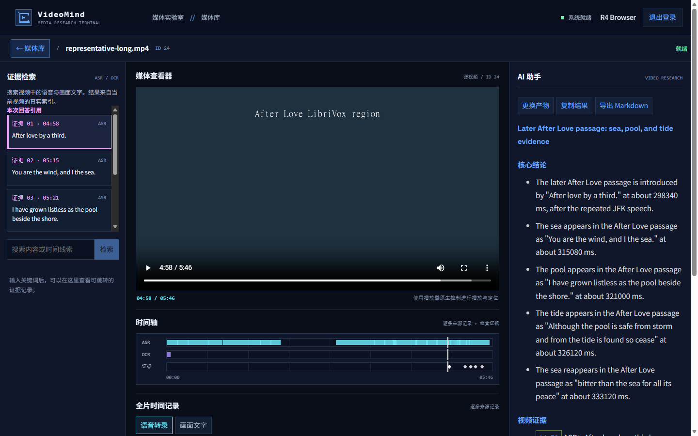
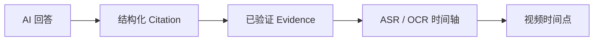
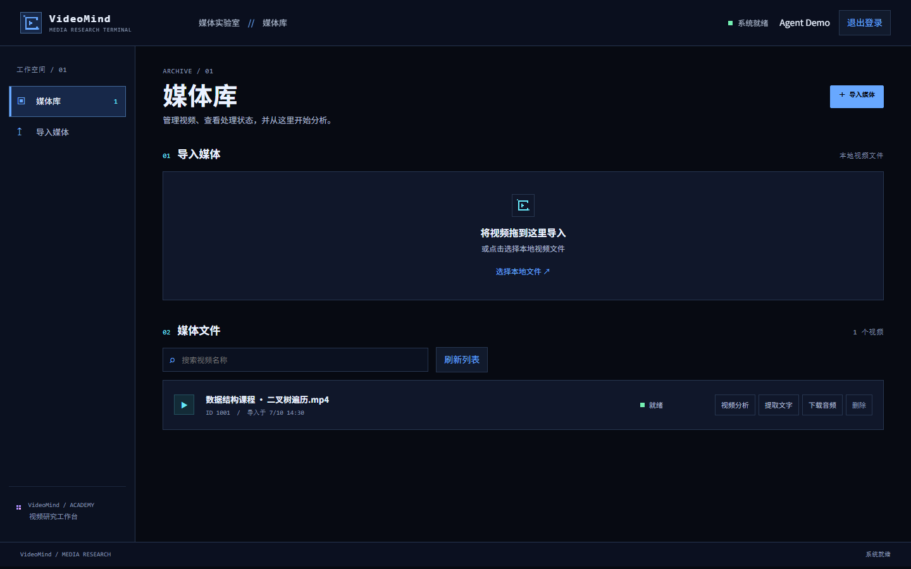
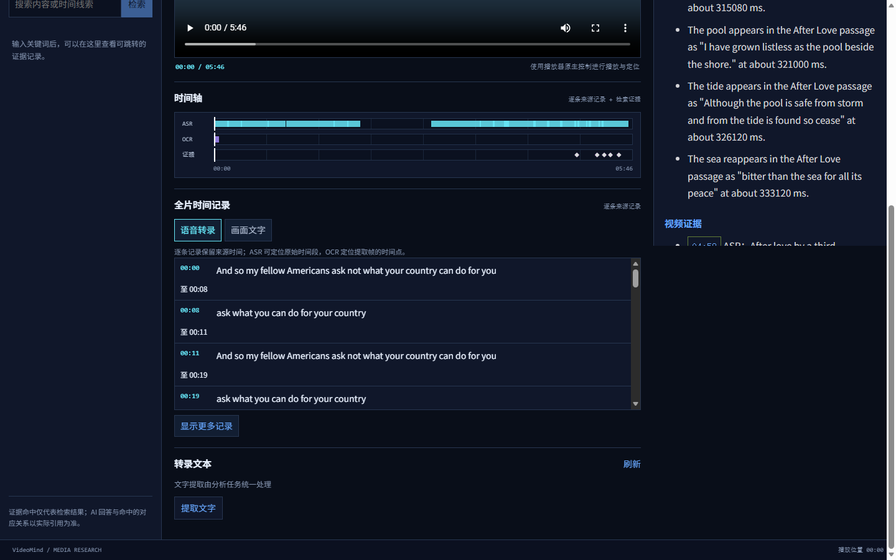

# VideoMind

> 面向长视频理解的 AI 视频分析工作台

VideoMind 是一个面向长视频理解的多模态 AI Agent 工作台。 系统通过 FFmpeg、Whisper ASR 和 OCR 将视频转换为带来源身份和时间信息的 VideoContext，再基于分层时间窗口、Chunk、BGE-M3 Embedding 与 Qdrant 混合检索构建 Evidence。分析侧采用 Planner → Executor → Critic 的多阶段 AgentLoop，并实现受限 Tool Calling、持久化 checkpoint、执行记录和 Historical Replay；模型生成的引用不会直接被信任，而是由应用层基于来源 ID、revision、原文及时间范围做确定性 Evidence 校验，最终实现 AI Answer → Citation → Evidence → Timeline → Video 的完整可追溯链路。
在模型执行层，我还实现了基于 Jev 的 FAST / BALANCED / DEEP 自适应路由：Jev 只负责提供 lane 建议，实际 provider/model/profile 由确定性策略控制，并支持低置信度、异常和不可用场景的安全回退及 durable route recovery。针对长视频 Agent 的 Prompt 膨胀和预算失控问题，又加入了阶段化 Context Projection、逐调用累计 Token Budget、Retry/Repair accounting 与模型调用遥测，将代表性长视频分析的模型用量从约 64k Token 优化到 22k–27k，同时保持 Critic 和可信 Evidence 引用。
系统后端使用 FastAPI、Celery、RabbitMQ、MySQL、Redis、MinIO、Qdrant 构成长任务执行与恢复链路，并实现失败任务重放、AI 交互限流和 SSE 状态推送；前端基于 Vue 3 构建中文视频分析工作台。除此之外，我还建立了版本化 Golden Dataset 和 X3 路由评估体系，对固定模型档位、规则路由与 Jev 路由进行了 80 次冻结实验，并保留了未达到预注册质量门槛的负实验结果。最终项目以 864 个后端测试、16 个前端测试和 GitHub CI 完成 v0.1.0 发布。



**视频 ↔ 时间轴 ↔ 证据 ↔ AI** · 中文工作台 · Pixel Future Academy

## 为什么是 VideoMind

长视频中的事实分散在语音与画面文字中。一次性把全部转录文本交给模型既昂贵，也很难把答案与原片对应。VideoMind 保存带时间的 ASR/OCR 来源记录，先检索再分析，并把经过校验的答案级引用连接到 Evidence、时间轴和播放器。



## 核心能力

| 能力             | 在工作台中的作用                                                                             |
| ---------------- | -------------------------------------------------------------------------------------------- |
| 长视频分析       | 60 秒上下文窗口、分块、分页时序记录和检索式上下文，让分析聚焦相关片段。                      |
| 多模态时间轴     | 在视频播放位置附近查看 ASR、OCR 和引用标记；逐条记录保留来源时间。                           |
| 可核查的 AI 证据 | 模型提出的引用要通过来源身份、原文和时间范围校验，才会成为可信的界面引用。当前为答案级引用。 |
| 分层分析         | Planner 制定任务，Executor 生成分析，Critic 检查结果；应用层负责确定性约束。                 |
| 预算与遥测       | 累计 token 预算在模型请求前准入，按阶段记录用量，压缩重复的 Prompt 内容。                    |
| 中文操作界面     | 媒体库、分析工作台与 Pixel Future Academy 视觉体系。                                         |

点击回答中的引用，可沿 **Citation → Evidence → 时间轴 → 视频** 返回原始片段。模型输出不能自行授予工具调用或证据可信性；只读工具和最终来源校验由应用代码控制。

## 界面

| 媒体库                                                       | 时序记录                                                                    |
| ------------------------------------------------------------ | --------------------------------------------------------------------------- |
|  |  |

主图与时序记录来自本地真实媒体验证；媒体库图使用内置演示数据。另见 [设计实验室截图](docs/assets/videomind-design-lab.png) 与 [Pixel Future Academy 规范](docs/design/DESIGN_SYSTEM.md)。

## 架构


Vue 3/Vite 提供界面，FastAPI 提供 REST 与 SSE。Celery/RabbitMQ 执行耗时任务；MySQL 保存持久记录，Redis 处理运行态，MinIO 保存媒体，Qdrant 建立向量索引。`VideoContext` 是时序来源的权威表示；检索与各 Agent 阶段只接收所需投影，避免重复传递完整媒体上下文。详见 [架构与权责边界](docs/ARCHITECTURE.md)、[时序读取模型](docs/VIDEOMIND_TEMPORAL_READ_MODEL.md) 和 [执行预算](docs/VIDEOMIND_R5_EXECUTION_BUDGET.md)。

## 快速开始

需要 Python 3.12+、Node.js 22.12+ 与 npm。开发者可以先启动无需外部服务的本地 API 与界面。创建虚拟环境后，先在当前终端激活它：POSIX shell 用 `source .venv/bin/activate`，PowerShell 用 `.\.venv\Scripts\Activate.ps1`。

```bash
python -m venv .venv
python -m pip install -e ".[test]"
python -m dovideo api
```

在另一个终端运行：

```bash
cd client
npm ci
npm run dev
```

打开 `http://127.0.0.1:5173`，后端健康检查为 `http://127.0.0.1:8000/health`。**本地默认组合用于界面与 API 探索；完整媒体处理需启动生产组合**：Docker Compose 的 MySQL、Redis、MinIO、Qdrant、RabbitMQ，独立 Celery worker，FFmpeg/ffprobe、Tesseract、Whisper，以及结构化聊天和 BGE-M3 Embedding Provider。按 [完整启动指南](docs/QUICK_START.md) 配置被忽略的本地环境文件。外部模型调用会产生供应商费用。

## 五分钟演示路径

1. 在媒体库导入一段有语音或画面文字的视频，等待上传完成。
2. 打开分析工作台并提交问题；生产组合中的 worker 会处理媒体和分析任务。
3. 查看 ASR/OCR 记录与多轨时间轴，搜索一个出现过的词。
4. 在 AI 回答中打开引用，查看 Evidence，点击时间标记跳到对应视频位置。

## 配置与开发

安全示例见 [.env.example](.env.example)。`DOVIDEO_*` 是为兼容现有 Python 配置保留的内部变量；公共产品名称为 VideoMind。真实分析需要设置聊天与 Embedding 凭据，默认关闭的自动路由不影响基本分析。完整环境变量、服务启动顺序及系统依赖见 [启动指南](docs/QUICK_START.md)。

```bash
python -m pytest -q
cd client
npm test
npm run build
```

项目保留可复查的 [X3 模型路由评估](docs/X3_OPENROUTER_X3_E_REPORT.md)。其完整 80/80 结果未通过预注册质量门槛，因此不以该实验宣称自适应路由优于固定策略。历史评估与当前产品能力分别呈现。

## 项目状态

当前为 **v0.1.0 公开版本**，适合本地运行、技术审阅和作品集展示；尚未发布托管服务。引用粒度为答案级，模型延迟与 token 消耗受上游供应商影响，完整运行依赖本地媒体工具及外部 Provider。后续可继续校准更长媒体的耗时与预算、细化引用归因及完善部署模板。

面试讲解与工程取舍见 [技术讲解指南](docs/INTERVIEW_GUIDE.md)，版本概览见 [v0.1.0 发布说明](docs/RELEASE_NOTES_v0.1.0.md)。

## 许可

MIT，见 [LICENSE](LICENSE)。前端基于公开项目改编，其来源和原有版权声明见 [client/NOTICE.md](client/NOTICE.md)。
