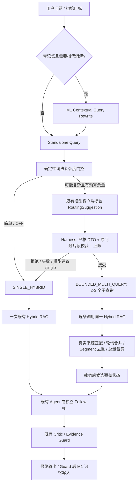

# M2 Adaptive Retrieval（2026-10-08）

实现名称：**LLM-assisted bounded multi-query retrieval**。默认 OFF。
M2 根据问题选择检索策略，复用现有 Hybrid RAG，不开启 X1，也不创建新的 AgentLoop。

## 源码审计与接入选择

基线 main 为 `14989de7bfd089acef767ba09b209746674736f5`（M1）。
既有 RetrievalPlanner 只产出 `semantic_query / keywords / visual_keywords`。
Hybrid 是 Dense Top8 + BM25 Top8 → RRF Top10 → 可选 reranker → Chunk Top3 → Segment 排序；
`search()` 最多 8 hits，`retrieve()` 原来可以返回更多 Segment，再交给 24,000 UTF-16 字符预算。
整个复杂问题只有一次查询时，多个独立证据位置会竞争这三个父 Chunk。

LongVideoContextService 同时服务 Agent 初始选证据和 GroundedFollowUp，且负责短视频绕过、
Chunk checkpoint 兼容性、索引和上下文预算。X1 search 工具也调用这个服务，但其策略和执行账本
针对一个已授权工具调用；用它作为初始路由会要求全局开启 Function Calling。
因此 M2 在它下方组合既有检索服务；R4 包装 `_StrictRetrievalService`，保留生产严格失败规则。
CLI 的真实模型分析路径也接入；无模型的 LocalR1 保留本地基线。

ModeRouter 选择输出模式，ModelRouting 选择 FAST/BALANCED/DEEP，RetrievalRouter 选择检索次数。
三者互不代替；M2 的规划复用 BALANCED 的既有 RetrievalPlanner chat 客户端。
没有改动 VideoRetrievalIntent 公共契约、向量索引、Chunking、排序、reranker 默认设置或 Evidence Guard。

## 两条执行路径



`RoutingSuggestion` 是不可信的冻结 Pydantic DTO，字段仅有 `retrieval_route / reason_code / sub_queries`。
`RetrievalDecision` 是 Harness 返回的不可变应用对象，固定最终 route、reason、fallback、执行 query tuple。
Provider 不决定媒体、版本、工具、候选上限或预算。应用在执行前重新验证 typed DTO，防止 `model_construct/copy` 绕过。

## 复杂度与子查询约束

词法门控识别 COMPARISON、TEMPORAL_CHANGE、MULTI_CONDITION、CAUSAL_CHAIN；其余为 SINGLE_FACT。
中英文关键词包括比较/相比/分别/区别、后来/转向/替换、并且/以及、因果链等。
只有潜在复杂问题请求额外规划；模型仍可建议 SINGLE_HYBRID。普通事实问题没有额外分类模型调用。

本轮选择**抽取式分解**：2–3 条子查询必须是原问题的连续片段，单条 2–500 字符，
非空、标准化后不重复，且不能等于整段原问题。Harness 校验片段包含关系。
这牺牲了自由改写能力，换取“模型不能新增实体、事实前提”的可执行约束。
无法安全抽取的问题回退基线；词法门控不是通用语义分类器，也可能漏掉隐式复杂问题。
子查询没有独立会话重写、递归规划或任意工具执行权。

理由枚举固定五项；single 必须是 SINGLE_FACT 和空子查询列表。
未知字段（包括 media_id/source_revision/tools/budget）、枚举错误、错误类型、JSON 重复键、
代码围栏、超过 8192 字符的 JSON 响应、超过数量/长度上限的计划均拒绝。
复用既有 chat stage，规划输出最多 1024 tokens、只允许一次 HTTP 尝试。

## 配置与回滚

| 环境变量 | 默认 | 应用硬上限 |
| --- | --- | --- |
| `DOVIDEO_ADAPTIVE_RETRIEVAL_ENABLED` | false | 布尔 |
| `DOVIDEO_ADAPTIVE_RETRIEVAL_MAX_QUERIES` | 3 | 1–3；1 禁止多查询 |
| `DOVIDEO_ADAPTIVE_RETRIEVAL_MAX_CANDIDATES` | 8 | 1–8 |
| `DOVIDEO_ADAPTIVE_RETRIEVAL_PLANNING_TIMEOUT_SECONDS` | 5 | >0 且 ≤10 秒 |

max_queries 同时限制子查询数量和每次 M2 操作的 Hybrid 调用总数，无另一份不一致的预算配置。
候选容量不足以为各子查询留位置时拒绝复杂规划。配置越界在 composition 阶段失败。
OFF 不安装包装器；显式构造 OFF 包装器也直接委托原 search/retrieve/index，保持响应 DTO 和原 retrieve 数量语义。

## 执行、合并与候选覆盖

同一次调用先把 chunks 固定为 tuple；所有子查询使用相同 media_id、source_revision、chunking_version。
混合 Chunk 版本在规划前拒绝。索引继续委托基线，M2 不重新建索引。
命中必须能映射到当前 Chunk 的真实 Segment、原始 ASR/OCR、时间、source_item_ids；陈旧版本和伪造摘录被过滤。
用既有 `segment_identity()` 去重，重叠父 Chunk 的同一 Segment 只保留首次实际命中。

每个子查询保留 Hybrid 内部排序；跨查询按第 1 条、第 2 条……有界轮询合并，
然后统一裁剪到最多 8 hits。不会用模型生成的 relevance score。
Agent 的结果映射回原始 canonical VideoSegment，继续走 LongContext 字符预算。
Follow-up 保留原候选摘录和 prompt 预算，再走自己的既有 Guard。

覆盖按**最终保留的候选**计算：ALL_SUBQUERIES_HAVE_CANDIDATES / PARTIAL_CANDIDATES / NO_EVIDENCE。
共享 Segment 可以为多个子查询提供候选。命中不代表语义证明；错误但真实的候选也可能通过文本来源 Guard。
M2 不生成答案、证据或语义覆盖分数，不把 query/规划/历史当视频事实。

## 预算、取消、失败及现有 Agent 关系

- Provider 失败、非法计划、局部规划超时回到一次基线检索；日志仅含有界理由。
- 总时限不足规划超时余量时选择基线；已耗尽的总时限、BudgetExceededError、取消原样传播。
- 多查询逐条检查 AgentExecutionBudget，并用其剩余时限约束 await；不创建新的外层 deadline。
- R4 每次真实模型调用继续走原 admission、tokens/cost 记账；规划 stage 的 output reserve 与 1024-token cap 一致。
- 子查询中途预算耗尽时终止，不把已经取得的部分结果伪装成成功的完整结果。
- **M2 不自行补检索**。原 Critic 保持定向补检索，显式进入 baseline scope，避免对同一缺口再次分解。
- X1 tools 同样使用 baseline scope，每个已授权 search 工具仍执行一次 Hybrid，ToolPolicy、计数、Checkpoint 和历史账本不变。
- 短视频初始选择仍绕过检索；Chunk checkpoint 复用仍由原 LongContext/chunks_compatible 决定。

## M1 调用顺序和可信边界

`Recent Turns / Rolling Summary → M1 Rewrite（需要时）→ Standalone Query → M2 → 当前视频候选 → Guard → Memory write`。
Follow-up 保持独立，不进入 Planner–Executor–Critic。原问题仍传给回答模型，M2 只接收改写后的检索问题。
History/Summary 不传给 M2 规划器或 Hybrid，不能进入候选证据；身份、租约/CAS、revision 失效和 request 回执仍归 M1。
新增集成测试实跑 Rewrite→M2→Hybrid→Follow-up Guard→记忆写入，并验证伪造引用被拒绝且不写入记忆。
请求级观测使用 ContextVar，不保存 service.last_result，避免并发检索状态串台。

## 观测与源码位置

复用 TelemetryPort 的 increment/observe：adaptive_route、routing_reason、routing_fallback、
subquery_count、retrieval_call_count、candidate_count、unique_evidence_count、coverage_status、route_latency_ms。
前三项和 coverage 用固定枚举后缀计数。route_latency_ms 是该次路由检索从规划到返回的总耗时。
模型调用和 Token 使用复用 R4 chat usage，Follow-up 沿用隔离 metrics/capture_chat_usage。
生产日志不含 query、ASR/OCR、历史或密钥。测试的 request-local capture 可观察决策与执行 query；
现有 capture_retrieval 获得合并后的初次排名，而不是第一条子查询的中间结果。

| 文件 | 职责 |
| --- | --- |
| `src/dovideo/application/adaptive_retrieval.py` | DTO、复杂度门控、Harness Policy、执行/合并/覆盖、scoped observation |
| `src/dovideo/infrastructure/adaptive_retrieval.py` | 少量环境配置与硬上限校验 |
| `src/dovideo/infrastructure/providers/model.py` | 复用 RetrievalPlanner adapter 的严格规划、1024-token cap、单次请求 |
| `src/dovideo/infrastructure/r4_runtime.py` | 包装严格 R4 Hybrid；复用 Token admission |
| `src/dovideo/presentation/composition.py` | 真实模型 CLI 接入 |
| `src/dovideo/application/long_context.py` | Critic 单次基线 scope |
| `src/dovideo/application/video_tools.py` | X1 单次基线 scope |
| `.env.example` | 总开关与三项约束配置 |
| `tests/application/test_m2_adaptive_retrieval.py` | Harness、实际 Hybrid、来源、预算、M1/Guard、并发、日志测试 |
| `tests/infrastructure/test_m2_adaptive_provider.py` | 严格 Provider、传输 cap、生产 M2/X1 开关四种组合 |
| `datasets/m2/adaptive-source.json` | 新的十案例合成跨片段数据；不复用旧饱和 12-case 集 |
| `tools/run_adaptive_retrieval_comparison.py` | 同一证据/问题的离线 A/B 与三组演示 |
| `docs/m2-comparison-results.json` | 实际执行原始结果；明确 synthetic/mock/offline/live-not-run |

## A/B 实测与限制

合成时间线覆盖 0–112 分钟，15 条 ASR、1 条 OCR；使用真实 VideoContextBuilder provenance、
现有滑窗 Chunking、Local TF-IDF cosine Dense、BM25、RRF 和 Segment 排序。
Routing 通过真实 Provider DTO adapter，但 completion 是 query-only 抽取式 FixtureChat Mock；
不读取 targets，不使用 gold 决策。Intent/Summary 为既有 local adapters。
没有改排序参数、TopK 或 embedding 模型，基线 A 是开关 OFF 的同一个 Hybrid。

| 实际指标 | A SINGLE | B Adaptive |
| --- | --- | --- |
| 案例数 | 10 | 10 |
| 有目标案例平均 Segment recall（9 案例） | 0.944444 | 0.944444 |
| Hybrid 调用总数 | 10 | 19 |
| 额外 routing completion（Mock） | 0 | 8 |
| 返回候选 | 22 | 34 |
| 原始摘录 candidate Guard 通过 | 22/22 | 34/34 |
| 最终路由符合人工期望（含非法计划降级） | 固定 single，3/10 | 10/10 |

**没有测得平均召回提升。** B-temporal 两组都找齐两处目标，Adaptive 额外带来干扰候选。
C-invalid-plan 两组都只命中 1/2 目标；拒绝越权计划后不会为了好看强行执行复杂检索。
missing-subgoal 和 no-video-evidence 在 TF-IDF Dense 中仍取得零相关度的真实候选，coverage 仍可能为 ALL。
这揭示候选 presence 与答案可证性的区别，不能把 ALL 当“有答案”；本轮不修改基线 no-answer/ranking 策略。

该表的 Guard 只验证取回摘录的来源，**不是最终回答语义正确率**。
最终答案/Critic、真实 LLM、BGE-M3、Qdrant、Cross-Encoder、真实视频、Provider Token/费用为 NOT_RUN/NOT_MEASURED。
JSON 保存离线 wall latency，但 Mock 与本地 embedding 不能代表远程 Provider 延迟或成本。
更复杂路由与更多候选不是质量提升的证据；默认 OFF 保留对照与回滚。

## 三组可复现演示

```powershell
.\.venv\Scripts\python.exe tools/run_adaptive_retrieval_comparison.py --output work/m2-demo-next.json
```

output 必须不存在，保留旧结果。读取 `cases` 中相应 case 的两组 arms：

1. **A-simple**：`MySQL initial selection transactions durability` → SINGLE_FACT → SINGLE_HYBRID →
   一次 Hybrid，零 routing completion；目标分钟 0，实际候选分钟 0、16。
2. **B-temporal**：`Initially MySQL initial selection transactions durability; later Redis migration rationale memory cache` →
   TEMPORAL_CHANGE → 受限 JSON 提议两个原问题片段 → Harness 接受 BOUNDED_MULTI_QUERY →
   两次 Hybrid → Segment 去重合并 → 实际候选分钟 0、32、16、72。
   0 分钟对应 MySQL 初始选择，32 分钟对应 Redis 迁移理由；覆盖表示两条查询都有候选。
   后续仍交原 Critic/Guard；这个 retrieval-only 演示不生成最终答案。
3. **C-invalid-plan**：Mock 在计划中增加 `media_id=999` → Provider 严格 DTO 拒绝 →
   Harness SINGLE_HYBRID / INVALID_PLAN → 只执行原问题一次，不访问其他媒体，不重试规划。
   目标只命中 1/2，缺失事实不会被模型计划填充。

补充的 `test_partial_no_evidence_stale_revision_and_forged_excerpt_filtered` 演示
PARTIAL/NO_EVIDENCE、陈旧 revision、伪造摘录过滤，以及固定两次调用后结束。
`test_m1_rewrite_precedes_router_and_guarded_memory_write` 演示原 Guard 拒绝虚构引用且不写入记忆。

## 验证记录

复用项目 Windows `.venv`，Python 3.13.3、Node 24.15.0/npm 11.12.1。
五个原 Docker 服务健康；测试使用专用 workspace 外 basetemp，避免旧 Windows temp ACL。
正常宿主执行环境处理 sandbox 内 Python 定位/Docker pipe 限制，没有替换虚拟环境或安装依赖。

- 改动前指定六组相关测试：135 passed。
- 原始 HEAD 导出到忽略的 `work/m2-original`：完整基线 **1181 passed / 36 skipped / 0 failed**（68.83s）。
  第一轮副本有 3 项 Git 历史读取错误，原因为父仓库所有权检查；只向测试进程注入精确 safe.directory 后通过，
  未修改原始源码或全局 Git 配置。日志为 `work/m2-baseline-correct.log` / `work/m2-baseline-correct.xml`。
- 最终完整后端：**1233 passed / 36 skipped / 0 failed**（62.83s），相比基线增加 52 个通过测试。
  日志为 `work/m2-backend.log` / `work/m2-backend.xml`；没有新增失败或跳过。
- M2 新测试（含 Provider/composition）：52 passed。
- 相关 Agent/Tool/M1/Follow-up 回归首轮：258 passed（当时包含 41 个 M2 测试）。
- 前端 `npm test`：86 passed，0 failed；`npm run build`：PASS（40 modules，1.10s）。
- 全量后端的 36 个 opt-in live 项目不自动启用；唯一警告为既有 Starlette/httpx 弃用。
- `git diff --check`、用户 interview-guide SHA-256 保留检查、敏感信息和提交范围审查在推送前执行。

完整后端最终命令：

```powershell
.\.venv\Scripts\python.exe -m pytest -q --basetemp='D:/Agent Learning/tmp/m2-full-final' -o cache_dir=work/m2-cache --junitxml=work/m2-backend.xml
.\.venv\Scripts\python.exe -m pytest -q tests/application/test_m2_adaptive_retrieval.py tests/infrastructure/test_m2_adaptive_provider.py --basetemp='D:/Agent Learning/tmp/m2-new-final' -p no:cacheprovider
```

Git：main、起始 HEAD 与实时远端一致；不 reset/clean/强推。`docs/interview-guide/` 保持原未跟踪状态，
不改动、不暂存、不提交。Commit/推送后的真实 SHA 在交付报告给出。

## 面试技术材料

简历描述：**在视频 Hybrid RAG 上实现默认可回滚的自适应检索路由，利用受限 LLM 抽取 2–3 个子查询，
由应用 Harness 校验来源范围、预算与执行上限，并以确定性轮询去重合并证据，接入独立多轮追问和既有 Critic/Guard。**

三个取舍：抽取式计划限制自由改写以约束新前提；组合现有 Hybrid 服务以保留排序与来源契约；
M2 不补检索、Critic/X1 不再分解以避免检索倍增。

五个重点源码：`RoutingSuggestion`、`RetrievalRoutingPolicy.decide`、`AdaptiveRetrievalService._multi_search`、
`RetrievalPlannerModelAdapter.suggest_retrieval`、`create_r4_provider_stack`。

五个可追问问题：

1. 为什么 JSON schema 校验不足以约束新增事实前提，抽取式片段校验解决什么、还遗漏什么？
2. 多查询轮询合并为什么能保留各子目标的候选，裁剪后如何重新计算 coverage？
3. ALL 候选、文本来源 Guard 通过和答案语义被证明为什么是三个不同条件？
4. 嵌套 deadline、模型 Token admission、检索次数上限分别控制什么，取消为何不能作为普通降级吞掉？
5. 为什么不直接启用 X1，Critic 与工具执行中如何防止 M2 的乘法预算增长和 Checkpoint 语义变化？
