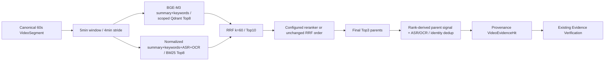

# VideoMind architecture and authority boundaries

This document follows one analysis from upload to replay. The same
application/domain behavior is composed behind FastAPI, a Celery worker, and
the smaller CLI path. Adapters provide I/O; they do not define separate Agent
or evidence policy.

## Resumable upload

The browser sends 5 MiB logical chunks with concurrency 3 (at most 410 chunks).
It keeps only a user-scoped UUID upload credential locally; server-confirmed
indexes determine resume progress. Network errors, HTTP 408/429/5xx have at most
four attempts with exponential backoff and jitter. Permanent 4xx are not retried.

Production uses Redis `upload:session:{uuid}` metadata and
`upload:parts:{uuid}` Set, both renewed to approximately 24 hours. MinIO stores
`chunk-uploads/{uuid}/part-{index}` bytes. Each chunk is persisted first, then a
guarded Redis Lua operation records its index and renews both keys atomically.
The operation refuses expired or completed sessions and cannot resurrect them.
An uncertain Redis confirmation leaves the object available for deterministic
re-upload. Pre-Set sessions get one guarded object-list migration; fresh
sessions never count unconfirmed MinIO objects as progress.

Completion validates ownership before acquiring the nonblocking per-upload
`lock:upload-merge:{uuid}` redis-py Lock, then rechecks the completion receipt
under that lock and verifies the exact index set `0..totalChunks-1`. Independent
uploads can merge concurrently. Ordered local workspace merge computes MD5
incrementally while bytes flow; this is a content fingerprint, not an upload ID
or pre-upload deduplication key.

The Redis lock has a 30-minute finite lease; the merge scope has a 20-minute
deadline. The owning token is renewed through the library's `reacquire()` at
chunk and persistence boundaries. Redis calls run outside the event loop;
MySQL connection/read/write I/O is bounded. A cancelled DB save is allowed to
settle before release because cancelling an asyncio await cannot cancel its
executor-thread transaction. There is no periodic watchdog. See
[redis-py Lock](https://redis.readthedocs.io/en/stable/lock.html).

The final object key is `media/upload-{uuid}{suffix}`. MySQL stores its durable
MediaRecord. Redis `upload:completed:{uuid}` retains the media ID, owner and
session shape for approximately 24 hours after completion. **The lock prevents
concurrent merges; the receipt provides business idempotency for later/lost
response retries.** If the durable row committed but receipt creation failed,
complete returns a retryable error and retains row/object/chunks. A retry under
the lock finds the same durable row by its exact deterministic source, writes
the receipt and returns the same media ID without another merge or insert.
Both receipt owner and durable row owner are checked.

Only after receipt success is temporary cleanup attempted, with its own
10-second budget outside the merge deadline. Cleanup failure does not change
the business result. Redis loss/expiry ends the coordination recovery window;
process pauses/failover beyond a lease and orphan objects are explicit limits.
This is not an exactly-once or distributed transaction guarantee. No SQL
per-chunk writes, content deduplication, instant upload, dynamic chunks, Java
lock client or server-side object compose are used. Local development keeps
its explicit process-local upload adapter; it is not a production fallback.

See [source audit](UPLOAD_FINALIZATION_AUDIT.md) and
[validation and failure semantics](UPLOAD_FINALIZATION_REPORT.md).

## Request and preparation lifecycle

The four AI interaction surfaces share a Redis + Lua distributed token bucket
with user and global dimensions. One atomic script uses Redis TIME to refill
both buckets continuously, checks both, and deducts one request token from
both or neither. Defaults are capacities 60/600 with a 60-second full refill
duration (1/10 tokens per second). Rejections return 429 with the rounded-up
maximum shortage wait; backend failures return 503 and fail closed.

Analysis admission follows authentication, validation, media ownership and
completed-result reuse, before dispatch to RabbitMQ/Celery. Follow-up and
evidence search check ownership before admission; route validates its goal
before admission. Status, SSE and ordinary reads consume no AI bucket tokens.
The bucket governs admission; the broker queues accepted work and task
idempotency prevents duplicate execution. These remain separate mechanisms.
Versioned v2 Hash keys avoid collisions with old String counters, use hashed
user identities, and expire after two full refill periods of inactivity.
See [request-level limiting and migration](AI_INTERACTION_RATE_LIMIT.md).

Analysis TaskLock is a renewable owner-token lease, independent of the upload
MergeLock. `SET NX PX` retains the default 15-minute TTL; TaskWorker starts a
per-delivery keeper which refreshes at TTL/3 through the existing atomic
GET-token/PEXPIRE Lua operation. LOCKED deliveries use a separate delayed
transport retry (5 seconds by default), without consuming a business attempt.
Transient renewal exceptions retry within the conservative last known expiry;
false ownership or expiry cancels cooperative work and prevents subsequent
worker, checkpoint and execution-history writes. Renewal is joined before
owner-safe release on every exit. Crash stops renewal, TTL expires, and late-ACK
RabbitMQ delivery can resume lifecycle/checkpoint work. Result persistence still
precedes lifecycle completion and the completion marker. This is not database
fencing or exactly-once: already-dispatched thread/third-party I/O may settle
after cancellation. See [lease audit](TASK_LEASE_SOURCE_AUDIT.md) and
[fault-window report](TASK_LEASE_REPORT.md).

1. The Vue client uploads media in bounded chunks and submits an analysis
   goal. FastAPI returns a task identity rather than holding the request open
   for extraction and model work. REST and SSE expose status and results.
2. Task lifecycle and idempotency checks limit duplicate work. Celery and
   RabbitMQ deliver long-running jobs. MySQL holds durable media, task,
   checkpoint, and execution records; Redis is used for hot state, locks,
   projections, and rate limits. MinIO holds media objects.
3. FFmpeg segments audio and extracts keyframes. Whisper ASR and Tesseract
   OCR produce observations with source times. `VideoContextBuilder` merges
   them into ordered temporal windows, preserving modality and origin.
4. Long-video preparation builds five-minute sliding chunks with one-minute
   overlap and four-minute stride. Scoped Qdrant dense candidates and in-process
   BM25 candidates are independently ranked, fused with RRF, optionally
   cross-encoder reranked, then expanded to canonical segments with stable
   identity deduplication. Retrieval returns candidate evidence; final answer
   verification remains separate. Videos at most five minutes retain the
   existing context-selection bypass.
5. `AgentLoop` resolves the model lane once, builds a bounded plan, executes
   structured rounds, invokes Critic, and can retrieve targeted evidence
   when feedback identifies a gap. `EvidenceVerificationService` checks final
   claim text, source identity, and timestamp coverage before a structured
   result is accepted.

The CLI can use local TF-IDF and process-local stores for development and
offline tests. That choice is explicit; it does not silently replace the
production SQL/Redis/MinIO/Qdrant composition. The standard-library web
demo is a legacy local presentation adapter; Vue/FastAPI is the product path.

## Long-video candidate retrieval

The last window is the first one covering the final segment end; empty gaps
are skipped. Segments intersecting a window remain whole. The chunk contract
is `video-chunk-5m-overlap1m-v2`; its version changes chunk IDs, not source
revisions or the content preprocessing reuse contract. Loaded checkpoints must
match the current deterministic window plan and exact source segment payloads.
An incompatible payload is rebuilt, saved and reindexed using existing fields.

Qdrant payloads include `chunkingVersion`. Current searches filter `mediaId`,
`sourceRevision` and `chunkingVersion` before Top-K selection. Old points may
remain stored but cannot consume current-version candidate slots. No whole-media
delete is required. Unscoped legacy reads remain supported; current hits must
also map back to the loaded chunk IDs/ranges and scope.

Healthy dense search results define the dense candidate set, including a valid
empty set. Base application falls back to local cosine on an unavailable/error
vector path, BM25-only on embedding failure, dense-only on BM25 failure, and
RRF order on enabled reranker failure. Strict R4 rejects those component
fallbacks. Disabled reranking is a configuration choice, not a failure.
Cancellation and BudgetExceededError propagate. See [retrieval contracts and
measured limits](RETRIEVAL.md).

X3 observes the first actual ranked retrieval call using caller-scoped transient
state, without another query or a production API change. One segment candidate
retains one rank and all source-item IDs in EvaluationRetrievedEvidence. Existing
Recall/Precision/MRR/temporal calculations are reused. An optional retrieval-only
mode on the existing runner measures retrieval without inventing an Agent answer
or an Evidence Guard pass; synthetic/real classification stays on the dataset.

## Why the boundaries matter

| Boundary | Owner and reason |
| --- | --- |
| Model output → plan | Plan validation enforces task shape and budgets; natural-language instructions alone do not authorize execution. |
| Retrieval → answer | Retrieval ranks likely source material. Evidence Guard independently validates the answer's cited source text and covered time range. |
| Model output → tools | `AgentLoop` and `ToolPolicy` authorize registered, same-video, read-only evidence tools. Requests have stable IDs, bounds, and recovery records; the model has no arbitrary computer-control authority. |
| Jev advice → execution lane | Jev can suggest FAST, BALANCED, or DEEP. VideoMind's deterministic threshold and fallback policy records the final lane and model once per Agent execution. |
| Durable record → replay | The durable execution record is historical truth. A checkpoint is recovery state and Redis is an operational projection. Replay reads the record without provider, retrieval, tool, or Jev calls. |
| Provider → application | OpenAI-compatible chat and embedding adapters translate requests and telemetry. The application consumes typed decisions and usage without granting providers policy authority. |

## Provenance from video to claim

The prepared source revision hashes normalized observations and a versioned
extraction contract, not a temporary input path. Segment and source-item IDs
derive from that revision. Final evidence keeps the source item, temporal
range, and original media identity needed to inspect the cited video range.

Evaluation exposed a concrete bug: an OCR frame reference included an
ephemeral extraction path. The same video prepared in two workspaces could
then produce different provenance IDs. `x2-a-v2` replaced that path with a
stable frame identity; `x2-a-v3` retained finer Whisper segment spans rather
than only coarse audio-file intervals. Historical records and
`golden-dataset-v1` were left untouched. `golden-dataset-v2` uses the newer
source revision and documents its evidence rebinding.

See [OCR provenance](PROVENANCE_V2.md), [ASR granularity](ASR_GRANULARITY_V3.md),
and the [dataset rebase record](../datasets/x3/DATASET_V2_REBASE.md).

## Routing and measured limits

The X3 benchmark froze a heterogeneous three-lane policy: FAST and BALANCED
used DeepSeek Flash with different reasoning settings; DEEP used DeepSeek
Pro. Model execution used OpenRouter with one pinned serving provider and no
fallback. Jev was a separate advisory call, and the VideoMind route record
remained the final authority.

The completed 80-result campaign did not establish a routing benefit. All
16 fixed-lane oracle entries reported no lane passing the preregistered
quality gate; both router arms executed BALANCED for all 16 cases. This is a
bounded negative finding under the specific dataset, provider, one-trial
design, and lexical gate. The [final evaluation report](X3_OPENROUTER_X3_E_REPORT.md)
separates measured cases, derived paired comparisons, incomplete costs, and
threats to validity.
