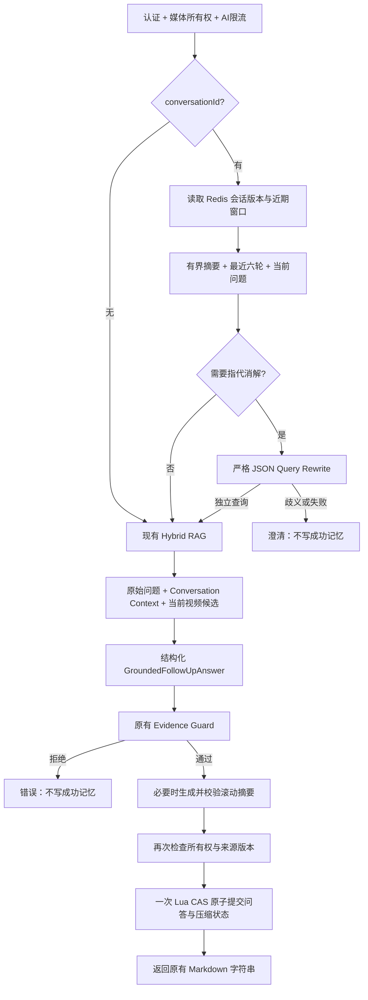

# VideoMind M1：两级会话记忆与可信多轮追问

本模块面向 Agent 开发面试展示。实现 Redis Recent Turns、LLM Rolling Summary、Contextual Query Rewrite 和现有 Evidence Guard 的连接，没有增加长期记忆数据库或新的 AgentLoop。

## 1. 源码审计与基线

实施工作区：`D:\Agent Learning\VideoMind-upload-finalization`，分支 `main`。原始本地 HEAD、origin/main 和实时远端 main 均为 `e75e8387afa1f5bf6c2c4b8ab10b1087fd66e32b`。原有未跟踪 `docs/interview-guide/` 保留，不纳入 M1 提交。

原 VideoMind 主线是 API 认证/所有权/限流 → ProductionR4Services → GroundedFollowUpService → Checkpoint context/chunks/可选结果 → 将当前 question 放入临时 context.user_goal → LongVideoContextService → 结构化回答 → EvidenceVerificationService → Markdown。缺口是每轮没有会话上下文，指代无法在检索前补全。它已经拥有独立追问、Hybrid RAG、来源版本和证据验证，无需重新进入完整 AgentLoop。

原作者参考：指定 SHA [`df4fa83…` 的 AiService.java](https://github.com/Xiaoc7r/DOVideo-AI/blob/df4fa83a78a51dfa1718606bf47cf49942e1112e/server/src/main/java/com/example/server/service/AiService.java)。已直接读取这个版本：最近十轮、七天 TTL，mediaId + goal/mode digest 隔离；先用原始 question 检索，再组合 history/evidenceSummary，最终进入 AgentLoop。吸收窗口/TTL 思路，但将指代消解提前到检索前，并增加用户、会话和 revision 隔离。本机另一份 DOVideo-AI 是不同 SHA，不能用它否定指定版本的功能。

插入点与签名：GroundedFollowUpService 增加可选 memory/access_check，answer 增加 user_id/conversation_id/request_id 关键字参数；回答 Provider 增加可选 conversation_context。未传 conversationId 时，服务保持原始流程，旧模型端口和旧 API 调用无需新增参数。

## 2. 完整架构



Memory 负责讨论连续性，RAG 获取当前视频事实，Harness 决定结构、预算、身份和证据合法性。独立查询仅用于检索；最终回答的 question 始终保留用户原意。

## 3. Recent Turns 与 Redis

身份为 user_id / media_id / goal_digest / analysis_mode / conversation_id / source_revision。user_id 来自后端认证，goal_digest 复用已有工具，conversation_id/request_id 规范化为 UUID。明确来源版本直接采用 VideoContext.source_revision；兼容旧 checkpoint 时，基于 source + segments 计算 legacy 摘要，排除 user_goal。

Redis key：`conversation:{media_id}:user:goal_digest:mode:uuid:source_revision`，同媒体的 key、租约、索引和删除标记使用相同 hash tag。值是严格 JSON 状态：version、turns、summary、receipts、summary_status。每轮包含 turn_id、question、answer、created_at、source_revision；answer 保存已验证 Markdown，因此历史恢复继续支持时间戳链接。

固定边界：近期完整六轮；问题 ≤500 字；每轮 Markdown ≤12,000 字；待压缩原始轮次最多20；摘要全部文本合计 ≤1600 字；上下文 JSON ≤80,000 字符。80,000 是六轮最大合法完整回答加摘要与编码开销的上限，通常实际输入远小于它；Provider 的既有模型调用/Token预算仍可提前拒绝。没有用无限历史 Prompt，也没有悄悄截短六轮问答。

会话数据及索引写入时刷新七天 TTL。75秒 token 租约覆盖60秒追问总时限和有界清理；同会话另一请求收到409，不并行覆盖同一轮次。Lua 同时检查租约 token、expected_version、删除标记，原子 SET/EXPIRE/索引登记；旧租约或旧版本都不能提交。

最多64条有界请求回执防止基本重复写入。尚未压缩轮次的重复 requestId 返回已保存回答；同 requestId 不同 question 返回409；已压缩但仍有回执的请求返回409，要求新 requestId，避免重新执行。它不是永久幂等账本，回执过期或超出64条之后不承诺无限期去重。

删除媒体后清理其索引记录的所有 revision/会话/租约，并留七天删除标记阻止在途请求复活。即使 Redis 不可用，API 与提交前的持久媒体所有权检查仍禁止使用已删除视频；清理失败可报错，现有数据最多按 TTL 过期。

## 4. Rolling Summary

未压缩原始轮次达到10时，把最早四轮和旧摘要交给同一个 ChatCompletionPort，保留最新六轮。下次积累四轮再压缩，正常序列为10、14、18轮触发。摘要只有 topics、entities、key_points、unresolved_questions、summary_text；严格校验字段、类型、数量和总长度，拒绝多余字段和重复 JSON key。

先在内存生成候选摘要并校验，再把新轮次、新摘要和删除四轮的状态一起 CAS 提交。摘要失败保留旧摘要及所有待压缩轮次，并提交 summary_status=failed；模型不可用记录 unavailable，预算不足记录 deferred。成功回答不会因为普通摘要异常而变成失败。

最多20轮待压缩原文。持续摘要故障到达容量时，不删除尚未摘要的历史，也不无限增长；返回本次已验证回答并明确提示“本轮对话暂未保存”，记录 capacity 和 memory_update_failed，本轮不会被记忆恢复。模型恢复后先压缩四轮再接纳新轮次，每请求最多一次摘要调用，后续逐步消化积压。没有后台任务、摘要树或分布式锁框架。

摘要 Provider 最多8秒；只有剩余预算充足时尝试压缩，整个可选记忆更新最多10秒。取消在模型/摘要等待阶段传播，并在提交前终止新轮次写入。Redis 已接受原子提交后的网络断开属于提交确认丢失，重试同 requestId 可恢复结果；这与主动取消提交前的请求不同。

## 5. Contextual Query Rewrite

简单正则检测“它、第二个、刚才那个、那为什么、前者”等引用形式，自包含问题直接走检索。判定规则容易测试，也可能保守地多做一次改写，不引入 Planner 或意图分类服务。

改写角色接收当前 question 和完整有界 Conversation Context，返回严格的 standalone_query / needs_clarification / clarification_question。应用验证协议，允许独立查询进入现有 LongVideoContextService，或返回无引用的澄清。无历史、Provider失败、非法 JSON/字段、超时都不会猜代词，也不会新增成功轮次。

Provider 复用现有结构化 JSON HTTP能力、AgentExecutionBudget和用量统计，stage 分别为 QUERY_REWRITE 与 ROLLING_SUMMARY。输出 cap 分别512与2048 Token，并将同一 cap 传给既有预算 admission；FOLLOW_UP 保持4096 cap。没有修改 Dense/BM25/RRF、RetrievalPlanner 或 Cross-Encoder 配置。

## 6. 证据与注入隔离

history/summary 放在 conversationContext，原分析结果放在 priorAnalysisContext；真实证据单独在 retrievedSourceCandidates。前两者没有来源候选索引，也不会进入 EvidenceVerificationService 的原始 context 或 observations。

最终仍执行原有候选索引、半开时间区间、ASR/OCR原文摘录、claim与回答绑定、source_item_ids、source_revision、provenance及claim支持检查。修改没有弱化该验证器。错误历史可以用于理解用户在谈什么，不能凭它构造可通过的原文引用。

所有历史/摘要/问题/视频文字以 JSON 数据进入固定角色提示；不作为 system 消息，不开放工具执行，不允许修改预算、身份或输出协议。Prompt约束与程序化证据验证共同防守；这里没有声称 Prompt 能消除所有语义攻击，也没有新增第二套 Critic。

## 7. API、前端与本地模式

`POST /analysis/follow-up` 新增可选 conversationId/requestId，成功 data 仍是 Markdown字符串，兼容 apiRequest().text()。认证、媒体所有权和 AI限流保留。`GET /analysis/follow-up/history` 是经过认证及所有权检查的只读接口，返回当前 revision 的未压缩成功轮次、摘要、状态和版本；不会加载全部聊天档案。

前端每个 user/media/goal/具体mode scope 保存一个 UUID，完整历史不进 localStorage。打开已完成分析时，从历史接口重建“原始分析 + 摘要 + 成功问答”，避免重复追加。刷新/关闭重开可恢复；新建对话换UUID；AUTO先落定具体mode；账号切换清空工作台。captureAuthSession、workspaceGeneration和historyGeneration共同拒绝迟到结果；网络失败重试同问题沿用 requestId。

恢复失败保留会话标识和当前内容，显示可理解错误；摘要中较早完整问答被删除后，只恢复摘要和当前窗口，不承诺无限完整聊天记录。时间戳渲染、SSE消息流和原有分析结果返回类型不变。

ProductionR4使用现有Redis Client及真实模型Provider；LocalR1使用InMemory Store和明确的确定性证据回答。LocalR1没有真实Query Rewrite/Summary模型，依赖上下文的问题会澄清，摘要状态为unavailable。完整四能力展示采用ProductionR4或下面明确标注的确定性测试Harness。

## 8. 可复现演示

在项目根目录运行：

```powershell
.venv\Scripts\python.exe tools/demo_conversation_memory.py --output work/m1-demo-results.json
```

[交付的实际演示结果](m1-demo-results.json)使用**合成ASR视频片段 + 确定性Mock ChatCompletionPort + 实际M1服务/Provider适配器/Evidence Guard**，没有真实视频或真实模型。演示脚本复用测试fixture，方便一起维护，不需要API密钥。

Case A：先问“视频中作者为什么选择Redis？”，再问“它和MySQL相比有什么不同？”。加载首轮记忆，改写并实际检索“视频中Redis和MySQL相比有什么不同？”，回答Provider仍收到原始“它…”问题。返回合成片段00:00–00:10的ASR引用，Evidence Guard通过。JSON含原始问题、加载记忆、独立查询、实际query和已验证答案。

Case B：连续十轮存储问题，第九轮没有摘要调用，第十轮压缩第1–4轮，保留第5–10轮与结构化摘要；下一轮“刚才那个…”的改写输入包含摘要。测试还验证第14轮旧摘要合并。JSON含触发轮次、被压缩问题、摘要、近期六轮与调用次数。

Case C：测试故意注入“Redis使用磁盘”的错误历史，再追问“它为什么用磁盘？”。当前ASR实际是“作者选择Redis是因为它使用内存保存数据；MySQL使用磁盘保存数据”。Mock先返回伪造引用，实际Evidence Guard返回evidence_rejected，轮数仍为1；随后引用真实ASR的回答通过。参数化测试同时验证错误滚动摘要不能变成视频引用。

真实Redis的Lua/TTL已另行测试。真实Provider + 真实视频的端到端验收未执行：当前环境没有配置模型端点/密钥，不能将这些Mock案例描述成真实模型效果。

## 9. 关键代码与技术取舍

| 位置 | 面试可展示的实现 |
| --- | --- |
| `src/dovideo/application/conversation_memory.py` | 严格DTO、六轮窗口、摘要准备及CAS状态提交 |
| `src/dovideo/infrastructure/conversation_memory.py` | Redis Lua租约/CAS/TTL/删除防复活及测试Store |
| `src/dovideo/infrastructure/providers/conversation_memory.py` | 两个受限LLM角色、JSON协议、超时 |
| `src/dovideo/application/follow_up.py` | 改写进入检索、原问题保留、Guard后记忆提交、版本重查 |
| `client/src/useAnalysisWorkspace.js` | UUID恢复、requestId重试、auth/workspace/history异步隔离 |

为什么Redis：已有生产基础设施，七天短期会话、TTL和单状态原子操作正合适，没有业务长期存档要求。为什么摘要：保留早期讨论主题，同时不让进入模型的完整轮次数无限增长；近期窗口解决即时指代，摘要保留较早背景。

为什么不用Qdrant：本轮没有跨会话长期语义搜索需求，已有Qdrant继续服务视频检索。为什么在RAG之前改写：检索词先消解“它”，后续候选才有机会匹配目标实体。为什么摘要不是证据：它是模型对讨论的压缩，可能偏离视频；可引用来源必须来自当前视频的真实候选及原文验证。

为什么不引入外部Memory Framework或让LLM自由管理所有记忆：只有固定四能力，明确的身份、成功写入、预算和CAS语义更容易审计及面试解释。LLM只提出改写和摘要，是否检索、是否保存、能否引用都由应用决定。

## 10. 面试讲解与准确边界

60秒讲解：原项目的追问虽然有Hybrid RAG和时间戳证据验证，但每次只检索当前问题，“它、第二种方案”缺少指代。我用Redis保存按用户、视频、目标、模式、会话和来源版本隔离的近期问答，模型每次读最近六轮；第十轮把前四轮合并到滚动摘要。检索前让受限LLM把指代问题改为独立query，回答时保留原始问题。历史和摘要只作上下文，事实引用仍来自当前视频ASR/OCR，通过原有Evidence Guard后才原子保存。CAS和短租约防止旧摘要覆盖，失败保留原文、取消不提前写入，前端仅存UUID并通过权限接口恢复。三组Mock案例和真实Redis测试验证了主线，真实模型视频效果仍需部署后验收。

五个深入追问：

1. **为什么同时有租约和CAS？** 租约让同会话顺序执行，减少重复模型调用；CAS/token检查阻止租约失效后的旧请求或旧摘要覆盖新状态。
2. **摘要失败是否丢历史？** 不替换旧摘要、不删除待压缩轮次，记录failed；最多20轮后对记忆写入施加背压，回答仍可返回，恢复后逐步压缩积压。
3. **历史错了怎么办？** 它可帮助解释问题，但没有来源候选身份。伪造ASR摘录或claim会被原有Guard拒绝，拒绝结果不成为成功轮次。
4. **视频重新解析了怎么办？** source_revision进入会话key，原revision历史不会被读取；模型/摘要计算结束后重新读取当前版本与媒体所有权，变化则拒绝提交。
5. **如何证明改写真的有用？** 展示独立查询确实进入retrieval.context.user_goal，且回答仍使用原始问题；目前证明的是流程和确定性案例，没有宣称真实模型检索指标提升。

可用简历表述：设计Redis近期窗口与LLM滚动摘要组成的两级会话记忆机制，实现多轮追问的上下文管理与指代消解；通过检索前Contextual Query Rewrite补全跨轮检索输入，并结合Evidence Guard与来源版本约束隔离历史记忆和视频证据。勿添加未经真实Provider实验的准确率或召回率提升数字。
