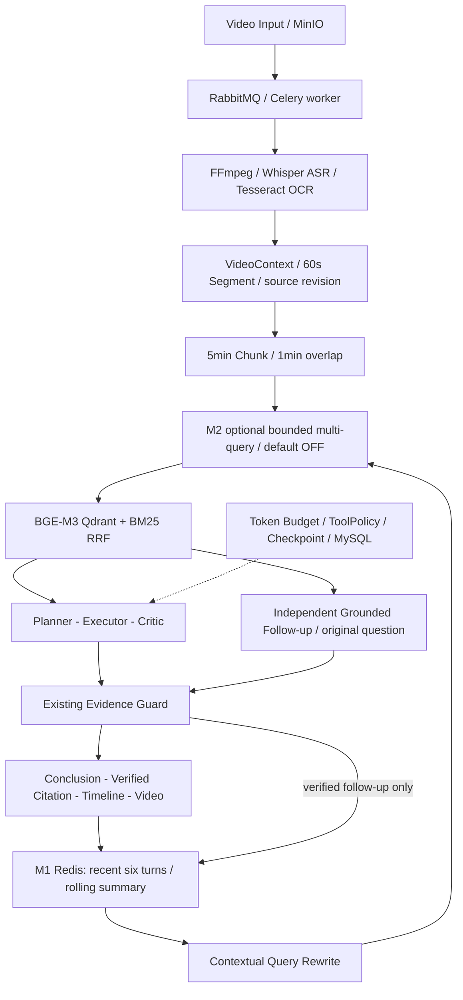

# VideoMind F1 — Final Grounding & Freeze Report

验收日期：2026-10-08（Asia/Shanghai）。以当前工作区实际源码与本轮执行结果为准。

## 1. Final Status

**CODE FREEZE READY — LIVE GATE PENDING**。

代码、确定性回归、前端交互、真实 Redis 和文档收口完成。最新生产 Agent 与 M1
真实视频/Provider 主线未执行，不能批准正式封板。M2 保留为默认关闭的实验能力。
未新增 Agent 框架、检索算法、模型或数据库，未改变任何 Evidence Guard 规则。

## 2. Git Baseline & Environment

- 工作区：`D:\Agent Learning\VideoMind-upload-finalization`；分支 `main`。
- 起始 HEAD / origin/main / 实时 GitHub main：`cd1eeb88ca7e15c18dba26adb43a0795636e282b`。
- M1：`14989de7bfd089acef767ba09b209746674736f5`；M2：上述起始 HEAD。
- 起始唯一变更为未跟踪 `docs/interview-guide/` 六个私人文件；本轮逐文件 SHA-256
  校验原样保留，不修改、不删除、不暂存、不提交。没有操作旧工作区。
- 复用现有 `.venv`（Python 3.13.3）、Node v24.15.0、已有 node_modules；没有安装依赖。
- MySQL / Redis / RabbitMQ / MinIO / Qdrant 五个既有 `dovideo-r2` 容器均 healthy。
  这只能证明容器状态；本轮除 Redis 外没有重新运行各服务认证读写验收。
- 当前项目根目录没有 `.env.r2.local` / `.env.r4.local`，进程没有模型或 Embedding
  配置；`work/media/representative-long.mp4` 不存在。FFmpeg/ffprobe/Tesseract
  不在当前 PATH，项目内 provisioned binaries 不存在；`.venv` 无 Whisper。
  API 8000 / Vite 5173 没有监听；Celery worker 启动与 broker inspect 为 NOT_RUN。
- 未扫描其他项目找密钥，也未复制其他项目配置。真实 Redis 测试仅从本项目既有
  Redis 容器读取密码到进程内存，不输出、不持久化；只清理 UUID 隔离的测试键。
- Git ownership 使用每命令 `safe.directory`，不改变全局信任设置。默认代理
  `127.0.0.1:7890` 不可用；提升网络执行权限并仅对 Git 命令关闭代理后，实时远端读取成功。

## 3. Project Capability Matrix

“历史”列是现存报告证据，未作为本轮重新通过。单元测试含 Provider 替身，不能据此推断真实质量。

| 模块 | 实现 / 本轮代码测试 | 本轮真实基础设施 | 最新真实视频/Provider | 默认状态 | 限制 |
| --- | --- | --- | --- | --- | --- |
| FFmpeg / ASR / OCR / VideoContext | 已实现，回归通过 | NOT_RUN | NOT_RUN；历史 R6 有真实记录 | 生产配置启用 | 当前缺媒体工具、权重及合法测试视频 |
| Dense + BM25 + RRF / Qdrant | 已实现，回归通过 | Qdrant healthy；读写 NOT_RUN | NOT_RUN；历史真实 BGE-M3 合成数据 A/B/C | 生产配置启用 | 历史真实 A/B/C 打平；reranker 默认 OFF |
| Planner–Executor–Critic / Harness | 已实现，回归通过 | 本轮 worker/API NOT_RUN | NOT_RUN；历史 R6 有真实 Agent 记录 | 生产主线 | 来源验证与模型语义判断职责不同 |
| Evidence Guard / Temporal Citation | 已实现，回归通过 | NOT_RUN | 最新真实视频 NOT_RUN | 开启 | 不提供确定性自然语言蕴含证明 |
| Claim-to-Evidence 展示 | F1 完成，API与Vue交互通过 | NOT_RUN | NOT_RUN | 当前结构化结果显示 | 老结果无合法引用时不生成绑定 |
| M1 Redis Memory | 已实现，回归通过 | REAL_INFRASTRUCTURE：4 passed | 两轮追问/Rewrite NOT_RUN | 生产 R4；local 有替身 | TTL七天、租约/CAS、六维身份；近期窗口六轮 |
| M1 LLM Summary / Rewrite | 已实现，确定性/Mock通过 | Redis存储另行验证 | 真实摘要/改写 NOT_RUN | 生产 R4 配置可用时 | 十轮摘要未实测；历史不能成为来源 |
| M2 bounded retrieval | 已实现，回归通过 | NOT_RUN | NOT_RUN | **OFF** | 十个合成案例无平均召回提升；候选覆盖不等于语义支持 |
| Async / Retry / Checkpoint / Replay | 已实现，回归通过 | 容器状态；本轮任务链 NOT_RUN | 历史 R6 真实运行 | 生产组合 | 幂等与租约有界，不保证无限故障下exactly-once |
| Jev / Function Calling / Token Budget | 已实现，回归通过 | NOT_RUN | 本轮 NOT_RUN；历史 X3/R6 | Jev与工具可选开关 | X3未通过预注册质量门槛；预算不保证Provider成功 |

## 4. Final Architecture



Memory 仅提供讨论上下文；视频事实来自当前来源版本的检索证据。M2 不创建新
AgentLoop，不递归规划；原 Critic 补检索与 X1 search 使用单次 baseline scope。

## 5. Live Validation

| 场景 | 本轮执行等级 | 实际结果与未验证项 |
| --- | --- | --- |
| A 原始视频 Agent | **NOT_RUN** | 缺本项目私有模型/Embedding配置、媒体及预处理工具；未提交假任务 |
| B M1 两轮连续追问 | **NOT_RUN**（真实路径） | 无真实 standalone_query/Provider回答，未冒充真实追问成功 |
| B M1 存储 | **REAL_INFRASTRUCTURE** | 既有 Redis，4 passed：原子写入/TTL/租约、旧CAS拒绝、删除阻止复活、坏状态/版本拒绝 |
| B Rolling Summary 十轮 | **NOT_RUN**（真实Provider） | 确定性测试含10轮触发、保留6轮、摘要失败与恢复；不计真实通过 |
| C M2复杂检索与single对照 | **DETERMINISTIC_TEST / MOCK** | 完整回归覆盖路由、2–3子查询、Hybrid次数、合并去重、Guard和M1顺序；真实Provider NOT_RUN |
| D 错误历史/伪造来源/时间 | **DETERMINISTIC_TEST** | 既有M1/Evidence/M2测试加F1来源投影测试全部通过；无真实业务数据污染 |
| D 来源变化/权限/删除 | **DETERMINISTIC_TEST**，删除存储另有真实Redis | 六维隔离、source_revision失效、无权媒体及删除拒绝均覆盖 |
| 前端结论点击 | **DETERMINISTIC_TEST** | 实际编译的Vue组件，合成来源响应；05:12→312s，选择既有证据标记、原文不注入HTML |

场景 A 的终态、执行轮次、Critic verdict、引用数、模型调用数与Provider Token用量
均 **NOT_RUN / NOT_MEASURED**。场景 B/C 同理，没有虚构复杂决策、语义正确率、
实时延迟或费用。本轮 harness 未发起任何真实模型调用；不代表生产账单已被审计。
未启用 M2 生产开关，也未改变任何默认值；无需回写私有文件恢复配置。

历史证据：R6 含真实视频、Provider与浏览器路径；
[检索 Live 报告](retrieval-quality-closure-live/REPORT.md) 使用真实 BGE-M3/Qdrant/reranker
但数据是合成 ASR/OCR，36个案例执行，A/B/C最终 Recall@3/MRR 均1.0。
这些不能替代最新 M1/M2/F1 的生产视频验收。

## 6. Claim-to-Evidence

现有 `/analysis/agent-citations` 默认仍返回兼容的 Citation 数组。新增可选
`includeConclusions=true`，在同一个已授权的媒体/goal/mode读取中返回
`{sourceRevision, conclusions, citations}`；未新增第二个API或Evidence Registry。
`conclusions` 直接来自 `AnalysisResult.conclusions`，`citations` 原样使用
`verified_answer_citations()` 的确定性来源校验，不修改Guard、不改checkpoint。

前端只按 `citation.claim === conclusion` 精确匹配，多条合法引用可以关联同一结论；
未绑定结论显示缺失状态。metadata 必须包含合法非负整数时间、来源身份和同一revision。
generation、媒体、目标、模式、内容、请求代次与 auth session 变化使旧响应失效；
用户切换即时清空，卸载取消可见更新。结论与摘录使用 Vue 文本插值，既有 Markdown
安全渲染和导出不变。按钮复用 selectCitation、seekVideo、播放器和时间轴。

这是**答案级证据绑定**，不扩展为每句/每token归因，也不把Agent原分析引用冒充
后续追问的结构化引用。语法与来源合法不能替代 Critic 语义判断或人工核查。

## 7. Tests

| 检查 | 本轮最终结果 |
| --- | --- |
| 完整后端，现有Windows `.venv` | **1235 passed / 36 skipped**；原有Starlette/httpx弃用warning 1 |
| Temporal read / Citation API针对性 | **8 passed**（在新增正向API测试后执行） |
| 真实Redis M1 opt-in | **4 passed**，1.35s |
| 前端 `npm test` | **100 passed / 0 failed**，含真实编译Vue组件交互 |
| `npm run build` | **PASS**，41 modules |
| `compileall`、`git diff --check` | **PASS** |
| 现有deployment模板校验 | **PASS**：环境契约与离线R4 API/worker composition |
| README与本轮文档本地链接 / 敏感信息扫描 | **PASS**，47个本地链接、高风险secret literal 0；不提交env、work、日志或凭据 |
| 私人资料 | **PASS**，六文件SHA-256一致且继续未跟踪 |

完整命令（Git只读信任配置通过进程环境提供，不写全局配置）：

```powershell
.\.venv\Scripts\python.exe -m pytest -q --basetemp='D:/Agent Learning/tmp/f1-backend-release-20261008' -o cache_dir=work/f1-cache --junitxml=work/f1-backend.xml
.\.venv\Scripts\python.exe -m compileall -q src tools scripts alembic
cd client
npm test
npm run build
```

本地原始结果保留在忽略的 `work/f1-backend.log`、XML、`f1-frontend.log`、
`f1-build.log`、`f1-redis-live.log`，不属于提交内容。
36项跳过是限流15、工程基础设施5、M1 Redis4、TaskLease3、Redis/MinIO上传9；
其中M1 Redis4已另行真实运行，其余32不作为本轮Live通过。
CI定义已审查：Linux Python3.12离线回归、compile、deployment、Compose、Alembic；
Node22前端test/build。本机通过不代表此提交的远端CI已经通过。

首轮完整回归有一项新增测试误预期上传后的revision为空，已更正为与实际来源投影一致；
不是源码缺陷。初次沙箱针对性运行受Windows运行环境限制中止，采用现有独立
basetemp并提升执行权限后验证成功，不计其未完成结果为通过。

## 8. Remaining Risks

- **P0：未发现未解决代码缺陷。**
- **P1验收阻塞：最新真实Agent与M1主线未运行。** 缺少当前项目获准Provider配置、
  合法测试媒体和预处理工具。属于验证空缺，不是已经证实的代码失败。
- **P2：真实十轮摘要与M2路径未运行。** M2仍为默认关闭实验，不宣称质量提升；
  十轮摘要按有限预算执行，额度不足继续如实NOT_RUN。
- **P2：语义质量边界。** 真实来源摘录可能仍与结论语义不符；Critic与人工核查
  不能由来源ID/文本包含验证替代。历史负实验继续有效。

不把已修复的历史R6问题再次列为OPEN，也不提出新的架构优化项目。

## 9. Final README

移除864/16的过期首页数字，区分历史v0.1.0与当前main，补充M1、M2默认OFF、
结论可点击来源、异步恢复和当前验收门槛。保留X3未过质量门槛、TF-IDF检索回退、
后续真实Provider合成数据打平和M2 A/B无平均召回提升，未把实现存在写成效果保证。
截图保留原有真实/演示说明，未把历史截图标为本轮真实验收。

## 10. Final Interview Highlights（五项）

| 解决的问题 | 核心方案 / 对应源码 | 可核查结果 |
| --- | --- | --- |
| 视频答案难溯源 | `application/evidence.py`、`temporal_read.py`、`client/src/AnalysisWorkspace.vue`：来源身份、时间与claim精确绑定 | F1来源/接口/点击测试；312s定位，非法/旧版本引用拒绝；最新真实视频待验收 |
| 指代追问失去检索上下文 | `application/follow_up.py`、`conversation_memory.py`、`infrastructure/conversation_memory.py`：Rewrite先检索、六轮/摘要、Lua CAS | 真实Redis4项；确定性改写进入检索、原问题保留、历史伪证据拒绝；真实LLM待验收 |
| 多目标证据竞争候选位 | `application/adaptive_retrieval.py`、`infrastructure/providers/model.py`：受限抽取式提案、有界执行、合并去重 | M2回归通过；离线recall两组均.944444、调用10→19，未证明提升，默认OFF |
| 长任务重试与崩溃恢复 | `application/worker.py`、`task_lease.py`、`infrastructure/celery_worker.py`：checkpoint/租约/幂等/持久dead-letter | 本轮完整回归；历史R6真实worker与浏览器记录，非无限exactly-once |
| 模型预算与路由越权 | `application/agent.py`、`execution_budget.py`、`infrastructure/r4_runtime.py`：Harness、分阶段投影、逐调用预算、受控lane | 历史R6代表视频约64k→22k–27k；X3 80/80未达预注册门槛，负结果保留 |

## 11. Git Delivery

本轮仅显式暂存F1源码、回归与必要文档。没有reset、clean、覆盖式合并或强推，
私人目录始终未跟踪；没有创建Release或tag。
报告所属F1 commit可通过 `git log -1 --format=%H -- docs/FINAL_FREEZE_REPORT.md`
确定。提交后以实时 `git ls-remote origin refs/heads/main`、local HEAD及origin/main
进行一致性复核，具体提交SHA与实际推送结果在最终交付回复记录，避免自引用哈希。

## 12. Final Freeze Decision

**尚不允许正式封板；CODE FREEZE READY — LIVE GATE PENDING。**

只需补齐现有生产组合运行条件，在预算内完成一次视频Agent任务（记录轮次、Critic、
Guard、引用与usage）、两轮M1追问（Rewrite实际进入检索、Guard后Redis写入及刷新恢复）
和真实Citation跳转。真实摘要争取完成，M2可继续排除在已验收主流程之外。
主线真实门槛通过、无P0/P1且Git远端一致后，才可改为 FINAL FREEZE APPROVED；
之后只接受明确缺陷修复、必要依赖维护与面试材料调整，不再开发新Agent功能。
